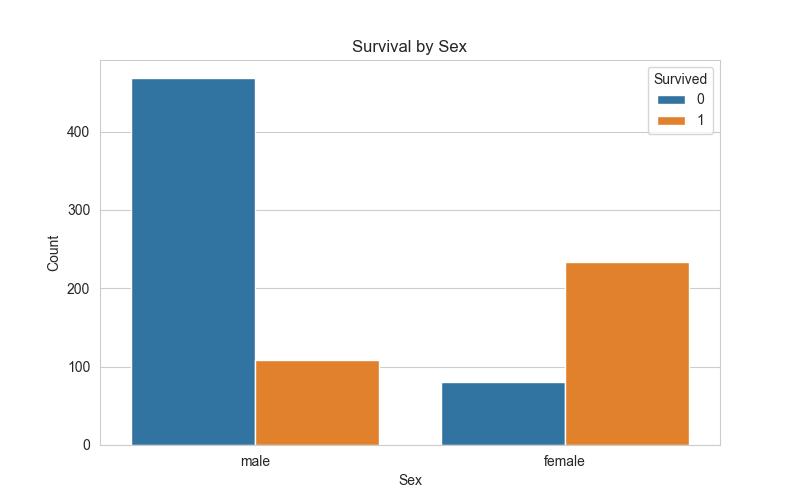
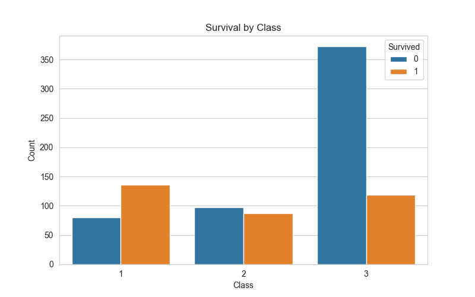
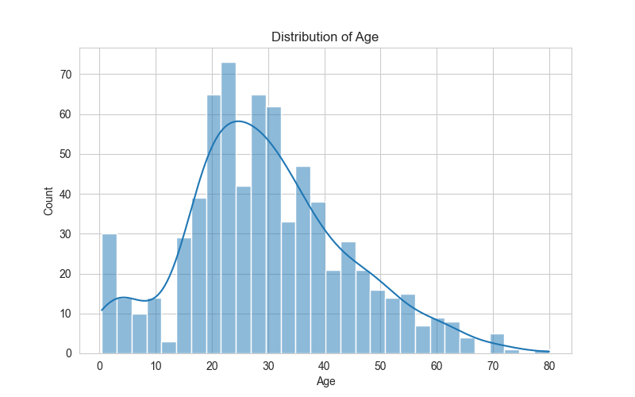
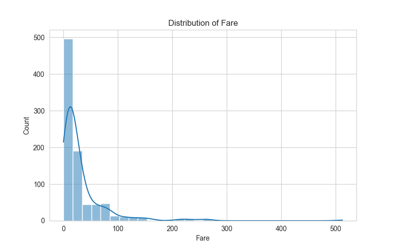
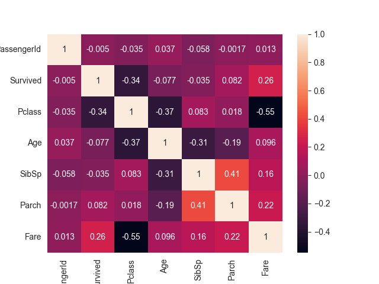

# Titanic Survival Prediction

Machine Learning project predicting passenger survival in the 
Titanic disaster using demographic and travel information.

The goal is to explore the dataset, engineer meaningful features,
and build predictive models capable of estimating survival probability.

---

# Problem

The sinking of the RMS Titanic is one of the most famous maritime disasters.
Using passenger information such as age, sex, class, and ticket data,
the objective is to predict whether a passenger survived.

This project applies data analysis and machine learning techniques
to identify the most important factors influencing survival.

---

# Dataset

Dataset from Kaggle:

Titanic - Machine Learning from Disaster

Features include:

- Passenger class
- Name
- Sex
- Age
- Number of siblings/spouses aboard
- Number of parents/children aboard
- Ticket number
- Fare
- Cabin
- Port of embarkation

Target variable:

- Survived (0 = No, 1 = Yes)

---

# Project Structure

```
titanic-survival-prediction/

data/
    processed/
    raw/
    submissions/

notebooks/
    01_eda.ipynb
    02_feature_engineering.ipynb
    03_modeling.ipynb

src/
    preprocessing.py
    features.py
    model.py
    train.py

models/
reports/
```

---

# Exploratory Data Analysis (EDA)

Key insights discovered during analysis:

- Women had a significantly higher survival rate than men.
- First-class passengers survived more frequently than third-class passengers.
- Children had higher survival probability.
- Passengers traveling in small families had better survival rates.
- Passengers embarking at Cherbourg showed higher survival rates, likely due to a higher proportion of first-class passengers.

Visualizations:







---

# Feature Engineering

Several new features were created to improve model performance:

### Family size

```python
FamilySize = SibSp + Parch + 1
```

Passengers traveling in small families showed higher survival rates.

### Has cabin

```python
train["HasCabin"] = train["Cabin"].notna().astype(int)
```

Passengers with recorded cabin information had a higher chance of survival.

### Deck extraction

```python
train['Deck'] = train['Cabin'].apply(lambda x: x[0] if pd.notnull(x) else 'U')
```

Deck information was extracted from the Cabin column.

### Categorical encoding

```python
train = pd.get_dummies(train, columns=["Embarked"], drop_first=True)
```

Categorical variables were transformed using one-hot encoding.

### Fare per person

```python
train['Fare_Per_Person']=train['Fare']/train['FamilySize']
```

This feature provides a more accurate representation of individual socioeconomic standing by normalizing costs across family units.

### Is alone

```python
train['IsAlone'] = (train['FamilySize'] == 1).astype(int)
```

While `FamilySize` provides granular data, this feature simplifies the feature space, allowing the model to focus on the significant survival gap between these two primary categories without the noise of specific family counts.

---

# WIP - Models Tested

The following models were evaluated:

- Logistic Regression
- Random Forest
- Gradient Boosting

Model performance was evaluated using accuracy on validation data.

---

# WIP - Results

Best performing model:

Random Forest Classifier

Accuracy: ~0.80

Most important features:

- Sex
- Pclass
- Fare
- Age
- FamilySize
- Title

---

# How to Run the Project

Clone the repository:

`git clone https://github.com/rodrigofl-dev/titanic-ml-project.git`


Install dependencies:

`pip install -r requirements.txt`

Run the training pipeline:

`python src/run.py`


<br>This will:

1. Load raw data  
2. Perform preprocessing  
3. Create features  
4. Train the model  
5. Generate predictions

Predictions will be saved in:

`data/submissions/submission.csv`

---

# Technologies Used

- Python
- pandas
- numpy
- scikit-learn
- seaborn
- matplotlib
- Jupyter Notebook

---

# Author

Data Science project developed as part of a machine learning portfolio.